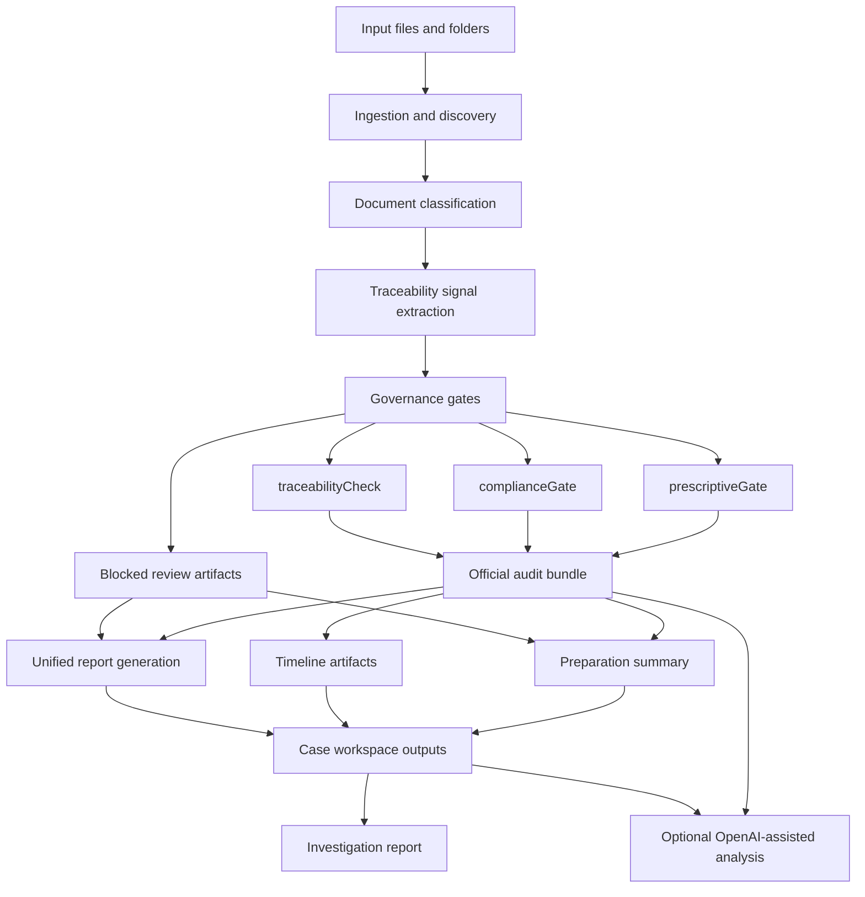

# TCRIA real architecture overview

This document replaces generic platform-style interpretation with the repository's actual governance-oriented processing model.

---

## Product purpose

TCRIA is not an accusation engine.

Its purpose is to:
- ingest legal evidence materials;
- classify and organize documentary artifacts;
- preserve traceability and custody signals;
- apply governance gates before risky outputs are promoted;
- generate auditable bundles and derivative reporting artifacts.

Legal judgment, accusation framing, and narrative responsibility remain with the human operator.

---

## Core workflow

The real repository flow is best understood as a governed evidence-processing pipeline.



---

## Main repository layers

### 1. Core package: `tcria/`

This is the product logic layer.

It should be understood as the main home for:
- engine behavior;
- models and settings;
- governance rules;
- reusable processing logic;
- CLI support.

This is the layer that should continue absorbing workflow logic over time.

### 2. CLI and case workspace orchestration

The command-line interface exposes operational workflows such as:
- one-off scan compatibility mode;
- product audit execution;
- case workspace initialization;
- case pipeline execution;
- final investigation generation.

At the moment, the CLI is also responsible for a large portion of orchestration behavior such as:
- case folder creation;
- manifest updates;
- invoking downstream scripts;
- collecting generated outputs into workspace folders.

This is useful operationally, but should gradually migrate toward dedicated workflow/service modules.

### 3. API layer: `api/`

The FastAPI application exposes the same operational capabilities for programmatic use.

Current responsibilities include:
- path validation and allowed-root enforcement;
- audit execution;
- official pipeline execution;
- case initialization and case execution;
- investigation generation;
- bundle conclusion rendering;
- optional OpenAI-powered analysis and institutional output generation.

The API should evolve toward depending on shared workflow services rather than CLI internals.

### 4. App layer: `app/` and `app.py`

The Streamlit layer acts as a user-facing runtime for interactive operation.

It should be treated as a presentation layer, not as the source of domain rules.

### 5. Script layer: repository-root generators and `scripts/`

Several artifact generators still exist as script-oriented modules.

These currently support outputs such as:
- case preparation summaries;
- timelines;
- unified governance PDFs;
- investigation reports.

This layer reflects useful product capability, but also shows where package consolidation is still needed.

---

## Canonical output model

The repository produces more than one artifact family.

### Primary governance outputs
- official audit JSON;
- official audit Markdown;
- blocked review JSON;
- blocked review Markdown.

### Secondary workflow outputs
- case preparation summary;
- timeline JSON and Markdown;
- unified PDF output;
- investigation report artifacts.

### Optional assisted-analysis outputs
- OpenAI Responses API audit explanation;
- institutional output rendering;
- conclusion reports derived from bundles.

---

## Governance boundaries inside the architecture

The key architectural distinction in TCRIA is not frontend/backend/database.

It is the separation between:

1. **organization and audit automation**, which the system is allowed to perform; and
2. **accusatory or judgment-bearing promotion**, which must remain human-declared and governed.

That boundary is operationalized through checks such as:
- `prescriptiveGate`;
- `complianceGate`;
- `traceabilityCheck`.

This means architecture decisions should continue prioritizing:
- auditability;
- custody preservation;
- reproducible artifacts;
- human accountability metadata;
- safe escalation boundaries.

---

## Current architectural debt

The current repository shows a healthy product direction, but also some transitional debt.

### Observed debt patterns
- workflow logic is concentrated in CLI code;
- API code imports terminal-oriented helpers;
- some artifact paths are recovered by parsing script stdout;
- operational scripts remain spread between root-level modules and script folders;
- architecture documentation previously described a generic stack instead of the actual governance flow.

### What to improve next
- extract reusable workflow services;
- standardize structured return payloads;
- validate artifact schemas;
- add regression tests around governance gates and case flow;
- reduce root-level script sprawl.

---

## Recommended target architecture

A cleaner long-term shape would look like this:

```text
tcria/
  engine/
  governance/
  workflows/
  artifacts/
  reports/
  api_contracts/
  cli.py
api/
app/
docs/
examples/
tests/
```

Where:
- `governance/` contains gate logic and policy checks;
- `workflows/` contains case and audit orchestration;
- `artifacts/` contains bundle generation and schema handling;
- `reports/` contains preparation/timeline/investigation renderers;
- `api_contracts/` contains request/response schemas shared with HTTP endpoints.

---

## Practical rule for contributors

When adding new functionality, contributors should ask:

- does this improve documentary governance or custody visibility?
- is the output reproducible and auditable?
- does this accidentally cross into autonomous accusation behavior?
- should this live in reusable product logic rather than a script wrapper?
- can this be validated by tests and stable artifact schemas?

If those answers are clear, the contribution is probably aligned with the intended TCRIA architecture.
